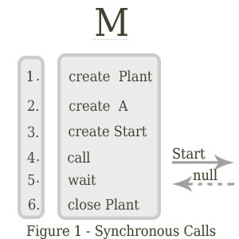
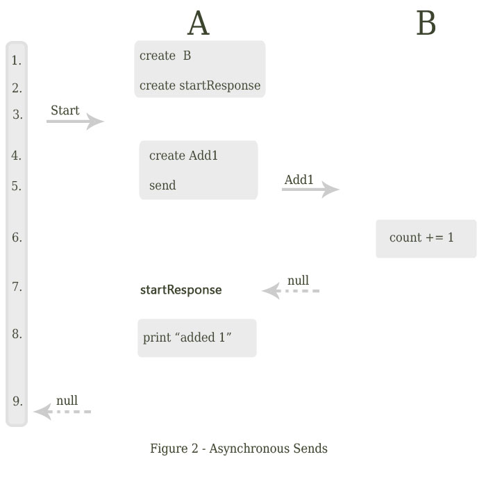
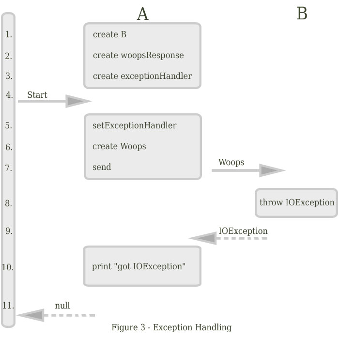

JActor2 is a multi-threaded OO programming model,
inspired by Alan Kay's early thoughts on [Objects](http://c2.com/cgi/wiki?AlanKaysDefinitionOfObjectOriented).
JActor2 is based on asynchronous 2-way messaging with assured responses.
The net result being code that is both simpler and more robust, and hence easier to maintain.

- [Background](#background)
    - [Multi-threading with Locks](#multi-threading-with-locks)
    - [Multi-threading with Actors](#multi-threading-with-actors)
- [Introducing JActor2](#introducing-jactor2)
    - [Synchronous Calls](#synchronous-calls)
    - [Asynchronous Sends](#asynchronous-sends)
    - [Exception Handling](#exception-handling)
    - [Request Factories](#request-factories)
    - [Parallel Processing](#parallel-processing)
- [Advanced Features](#advanced-features)
    - [Canceled Requests](#canceled-requests)
    - [Partial Failure](#partial-failure)
    - [Direct Method Calls](#direct-method-calls)
    - [Message Buffers](#message-buffers)
    - [Thread Migration](#thread-migration)
    - [OnIdle](#onidle)
- [Alternative Implementations](#alternative-implementations)
    - [Reactors](#reactors)
    - [Request Passing](#request-passing)
    - [Request Types](#request-types)
- [Next Step](#next-step)
- [Upcoming Projects](#upcoming-projects)
- [Links](#links)

Background
=====

Multi-threading with Locks
-----

Computers continue to increase in power, but they do so by adding more processing cores.
Over time then, applications which are not able to make use of all the threads supported by the newer
computers will end up using a smaller and smaller proportion of the available resources.

Problems often arise when more than one thread is executing the same code. This is not an issue for code that is
thread safe. But when code is not thread-safe, there can be non-deterministic
behavior, called race conditions, which vary depending on the exact order of execution and on if both threads share the
same memory cache.

Race conditions need to be identified and the unsafe code is typically surrounded by a lock which prevents more than
one code from executing the same code at the same time. But the identification of race conditions is often difficult,
and the use of locks can slow execution considerably.
When more than one lock is used, a deadlock can result if the locks are not always used by all thread in the same
order. The requirement of maintaining a consistent locking order sometimes becomes difficult as well, as the order must
be global in scope.

Multi-threading with Actors
-----

[Actors](http://en.wikipedia.org/wiki/Actor_model) are an alternative strategy to multi-threading with locks.
Actors are light-weight threads which interact via messages passed between them. Each actor has a queue of
pending messages (an inbox). And there is typically a thread pool used to process a queue of inactive actors
which have messages pending. Once an actor receives control, i.e. is assigned a thread, it process its pending
messages until there are none remaining and then releases the thread.

An actor never receives control from more than one thread at a time.
So the messages sent to an actor are processed one at a time.
This is how race conditions are prevented.
But there are several problems with actors:

- Actors provide 1-way messaging with problematic support for request/response.
And there is no assurance that a response will be received.
- Excessive dependency on 1-way messaging sometimes leads to message flooding, which slows
garbage collection and gives rise to the occasional out-of-memory error.
- Actors tend to be fragile, with restarts by supervisors and consequently the potential for lost messages.

Actors generally implement request/response (2-way messaging) in one of two ways,
either by blocking the thread until a response is
received, or by selecting only the expected response message for processing and processing other messages
only after the response has been processed. Either way, there is the
possibility of a deadlock occurring, depending on the design of the actor to which the request is sent.

The simplest case of deadlock is when two actors each send a request to the other. At this point, neither
actor will process any further messages. A review of each actor in isolation will not reveal any problems,
as this is a case of actor coupling.

Unfortunately, this problem rarely comes up in simple designs or initial implementations. It is only as
the code matures and the complexity increases that deadlocks begin to occur. Supervisors detect such failed
actors and restart them, which in turn gives rise to the increased chance that messages will be lost. So
timeouts are often added, further increasing the complexity of the code and potentially giving rise to an
increasing frequency of deadlocks.

Coupling, as we all know, is a bad thing. What we really need is another way to handle request/response, where
the processing of the response is specific to the request and with provision for intermediate state. This was the
starting point for JActor2.

Introducing JActor2
=====

JActor2 differs from other actor frameworks in several ways:

1. Request messages are single-use objects and are bound to the actors they operate on,
providing a context for subsequent interaction with other actors.
2. Uncaught exceptions and responses are passed back to the context from which a request originated,
modeling the way exceptions and return values are handled with Java method calls.
3. For every request that is sent to another actor, there is every assurance that a response or exception
will be passed back.
5. Messages (requests/responses) are processed in the order they are received by an actor.

There are three things of particular note here:

1. Uncaught exceptions are passed back to the context which originated a request, i.e. to the context most likely able
to handle those exceptions. This differs from more traditional actor frameworks where the supervisor of an actor
must handle the exceptions without knowledge of the context from which they arose.
2. A response or exception is passed back for every request that is sent, though processing is entirely asynchronous.
This is largely the result of modeling requests after Java method calls, but with additional support for detecting
infinite loops and erroneous request processing.
3. Messages are not selected for processing based on the state of the actor, but are processed in the order received.
Actors then are not coupled, so
deadlocks are less likely and maintenance is much easier over the life of a project.

Before going any further, we need to define a few terms:

- Actors in JActor2 are called
[reactors](http://www.agilewiki.org/docs/api/org/agilewiki/jactor2/core/reactors/package-summary.html).
Reactors are composable.
- The components of a reactor are called
[blades](http://www.agilewiki.org/docs/api/org/agilewiki/jactor2/core/blades/package-summary.html).
A blade has state and a reference to the reactor it is a part of,
though the default constructor of a blade will often create its own reactor.
Blades define the requests which operate on their state.
- Messages are called
[requests](http://www.agilewiki.org/docs/api/org/agilewiki/jactor2/core/requests/package-summary.html)
and are first class single-use objects.
Requests are bound to a blade or reactor and are evaluated (executed)
only on the reactor's thread.
After a request has been evaluated and has a result, it becomes a response
and is passed back to the reactor which originated the request.
- When a request is sent by one actor to another actor, a callback is assigned to the request.
The callback is a subclass of
[AsyncResponseProcessor](http://www.agilewiki.org/docs/api/org/agilewiki/jactor2/core/requests/AsyncResponseProcessor.html)
and has a single method, processAsyncResponse.
When a response is passed back to the originating reactor, the processAsyncResponse method is called on the thread of
the originating actor.
- The [Plant](http://www.agilewiki.org/docs/api/org/agilewiki/jactor2/core/plant/package-summary.html)
is a singleton which creates the thread pool used by the reactors.
Plant's methods are all static.

Synchronous Calls
-----

Reactors mostly interact with other reactors, but it is not turtles all the way down. Java programs begin of course
with a main method. To pass a request to a reactor, we use the request's call method.

The call method is synchronous. The thread is blocked until a response value or an exception is passed back.
The return value of the call method is the response value assigned by the request when it is evaluated by the
reactor. But when an exception is passed back, it is thrown.

```java

    import org.agilewiki.jactor2.core.plant.Plant;

    public class M {
        public static void main(final String[] _args) throws Exception {
            new Plant();
            try {
                A a = new A();
                a.new Start().call();
            } finally {
                Plant.close();
            }
        }
    }
```

1. A Plant is created. Plant in turn creates the thread pool.
2. A blade, A, is created, which in turn creates its own reactor.
3. A request bound to blade A, Start, is created.
4. The Start request is added to the inbox of A's reactor.
5. The main thread waits for an assured response or an exception. (A
[ReactorClosedException](http://www.agilewiki.org/docs/api/org/agilewiki/jactor2/core/reactors/ReactorClosedException.html)
is thrown if the Start request hangs.)
6. The plant is closed, which in turn closes blade A's reactor and the thread pool.



Asynchronous Sends
-----

Messages are always passed asynchronously between reactors. Two-way messages are passed
using the send method on the AsyncRequest class. And the two arguments to send are
(1) the request to be invoked on the target reactor and (2) the callback to be executed
on completion of that request.

A request/response exchange between actors does not block

Let use say that a Start request in blade A is to send an Add1 request to blade B.

```java

    import org.agilewiki.jactor2.core.blades.NonBlockingBladeBase;
    import org.agilewiki.jactor2.core.requests.AsyncResponseProcessor;

    class A extends NonBlockingBladeBase {
        class Start extends AsyncBladeRequest<Void> {
            B b = new B();

            AsyncResponseProcessor<Void> startResponse = new AsyncResponseProcessor<Void>() {
                @Override
                public void processAsyncResponse(Void _response) throws Exception {
                    System.out.println("added 1");
                    Start.this.processAsyncResponse(null);
                }
            };

            @Override
            public void processAsyncRequest() {
                send(b.new Add1(), startResponse);
            }
        }
    }

    class B extends NonBlockingBladeBase {
        private int count;

        class Add1 extends AsyncBladeRequest<Void> {

            @Override
            public void processAsyncRequest() {
                count += 1;
                processAsyncResponse(null);
            }
        }
    }
```

1. Blade B is created in the constructor of the Start request.
2. The startResponse is created.
2. The startResponse is assigned to the Start request and the Start request is added to the inbox of blade A's reactor.
3. Blade A's reactor evaluates the Start request. The Start request creates the Add1 request.
4. The  Start request is added to the inbox of Blade B's reactor.
5. Blade B's reactor evaluates the Add1 request. The Add1 request adds 1 to blade B's count.
6. The Add1 request is assigned a result value of null and is passed back to blade A's reactor.
7. The startResponse callback is evaluated by blade A's reactor. The callback prints "added 1".
8. The Start request is assigned a result value of null and is passed back to the reactor which originated the
Start request.



Exception Handling
-----

When an exception is raised and uncaught while processing a request, the natural thing to do is to pass that exception
back to the originating request. It would be nice to use try/catch to intercept that exception in the originating
request, but that is simply not possible. So we use an
[ExceptionHandler](http://www.agilewiki.org/docs/api/org/agilewiki/jactor2/core/requests/ExceptionHandler.html)
instead.

```java

    import org.agilewiki.jactor2.core.blades.NonBlockingBladeBase;
    import org.agilewiki.jactor2.core.requests.AsyncResponseProcessor;
    import org.agilewiki.jactor2.core.requests.ExceptionHandler;

    class A extends NonBlockingBladeBase {
        class Start extends AsyncBladeRequest<Void> {
            B b = new B();

            AsyncResponseProcessor<Void> woopsResponse = new AsyncResponseProcessor<Void>() {
                @Override
                public void processAsyncResponse(Void _response) {
                    System.out.println("can not get here!");
                    Start.this.processAsyncResponse(null);
                }
            };

            ExceptionHandler<Void> exceptionHandler = new ExceptionHandler<Void>() {
                @Override
                public void processException(final Exception _e,
                                             final AsyncResponseProcessor<Void> _arp)
                        throws Exception {
                    if (_e instanceof IOException) {
                        System.out.println("got IOException");
                        _arp.processAsyncResponse(null);
                    } else
                        throw _e;
                }
            };

            @Override
            public void processAsyncRequest() {
                setExceptionHandler(exceptionHandler);
                send(b.new Woops(), woopsResponse);
            }
        }
    }

    class B extends NonBlockingBladeBase {
        class Woops extends AsyncBladeRequest<Void> {

            @Override
            public void processAsyncRequest() throws IOException {
                throw new IOException();
            }
        }
    }
```

1. Blade B is created in the constructor of the Start request.
2. The woopsResponse is created.
3. The exceptionHandler is created.
4. The Start request is added to the inbox of blade A's reactor.
5. Blade A's reactor evaluates the Start request.
The start request is assigned the exceptionHandler.
6. A Woops request is created.
7. The woopsResponse is assigned to the Woops request and the Woops request is added to the inbox of blade B's reactor.
8. Blade B's reactor evaluates the Woops request,
which throws an IOException.
9. The Woops request is assigned a result value of IOException and is passed back to to blade A's reactor.
10. The exceptionHandler is evaluated by blade A's reactor with a value of IOException, and
prints "got IOException"
11. The Start request is assigned a result value of null and
is passed back to the reactor which originated the Start request.



When a request does not have an exception handler, any uncaught or unhandled exceptions are simply passed up
to the originating request. Exceptions then are handled very much as they are when doing a method call.

There is a huge advantage to this approach. When a request is sent, the originating request will **always** get
back either a result or an exception. So you do not need to write a lot of defensive code, making your applications
easier to write and naturally more robust.

Request Factories
-----

Nested classes impede decoupling, which is important for clarity, testing and reusability.
But by introducing request factory methods we can then use interfaces to decouple our blades.

```java

    import org.agilewiki.jactor2.core.blades.NonBlockingBladeBase;
    import org.agilewiki.jactor2.core.plant.Plant;
    import org.agilewiki.jactor2.core.requests.AsyncRequest;
    import org.agilewiki.jactor2.core.requests.AsyncResponseProcessor;

    interface B {
        AsyncRequest<Void> newAdd1();
    }

    class BImpl extends NonBlockingBladeBase implements B {
        @Override
        public AsyncRequest<Void> newAdd1() {
            return new AsyncBladeRequest<Void>() {
                int count;

                @Override
                public void processAsyncRequest() throws Exception {
                    count += 1;
                    processAsyncResponse(null);
                }
            };
        }
    }

    class A extends NonBlockingBladeBase {
        public AsyncRequest<Void> newStart(final B _b) {
            return new AsyncBladeRequest<Void>() {
                AsyncRequest<Void> dis = this;

                AsyncResponseProcessor<Void> startResponse = new AsyncResponseProcessor<Void>() {
                    @Override
                    public void processAsyncResponse(Void _response) {
                        System.out.println("added 1");
                        dis.processAsyncResponse(null);
                    }
                };

                @Override
                public void processAsyncRequest() throws Exception {
                    send(_b.newAdd1(), startResponse);
                }
            };
        }
    }

    public class M {
        public static void main(final String[] _args) throws Exception {
            new Plant();
            try {
                A a = new A();
                B b = new BImpl();
                a.newStart(b).call();
            } finally {
                Plant.close();
            }
        }
    }
```

Parallel Processing
-----

So far everything we have looked at, while fully asynchronous, is entirely sequential--doing one thing at a time in
a pre-determined order. But doing things in parallel is as simple as having multiple sends.

```java

    import org.agilewiki.jactor2.core.plant.Plant;
    import org.agilewiki.jactor2.core.reactors.NonBlockingReactor;
    import org.agilewiki.jactor2.core.requests.AsyncRequest;

    public class AllMain {
        public static void main(final String[] _args) throws Exception {
            new Plant();
            try {
                new All(new A1(), new A1(), new A1()).call();
            } finally {
                Plant.close();
            }
        }
    }

    class All extends AsyncRequest<Void> {
        final AsyncRequest<Void>[] requests;

        All(final AsyncRequest<Void> ... _requests) {
            super(new NonBlockingReactor());
            requests = _requests;
        }

        @Override
        public void processAsyncRequest() throws Exception {

            AsyncResponseProcessor<Void> responseProcessor = new AsyncResponseProcessor<Void>() {
                @Override
                public void processAsyncResponse(Void _response) throws Exception {
                    if (getPendingResponseCount() == 0)
                        All.this.processAsyncResponse(null);
                }
            };

            int i = 0;
            while (i < requests.length) {
                send(requests[i], responseProcessor);
                i += 1;
            }
        }
    }

    class A1 extends AsyncRequest<Void> {
        A1() {
            super(new NonBlockingReactor());
        }

        @Override
        public void processAsyncRequest() {
            System.out.println("A1");
            processAsyncResponse(null);
        }
    }
```

In the above example there is no persistent state, which is why there are no blades. Instead we just define
request classes and in their constructors we create the required reactors.

One new method has been introduced in the responseProcessor, getPendingResponseCount(). JActor2 tracks the
number of incomplete subordinate requests and this method returns their count. We use this method to ensure that
all the requests have completed before the All request returns a null response value.

Advanced Features
=====

JActor2 goes well beyond basic 2-way messaging, providing a comprehensive and robust set of features.

Canceled Requests
-----

Requests are canceled when they are no longer useful and once canceled, a request can no longer send subordinate
requests. This has the obvious advantage of quickly freeing up
resources being used by requests that are no longer relevant.
There are a number of ways a request can be canceled:

- When a reactor is closed,
all pending requests sent by that reactor are canceled.
- When a request completes or a request is canceled,
all pending requests sent by that request are canceled.
- The application logic of a request can explicitly cancel a request or all pending requests.

Of course, there may be some cases where just canceling a request might corrupt the state of a reactor.
But the application logic has the option of overriding the AsyncRequest.onCancel method.

Most cancellations occur when a reactor has outstanding requests and an uncaught RuntimeException occurs.
The exception causes the reactor to close, and the outstanding requests are canceled in turn.
But there are cases when a request is canceled because it is no longer useful.
Consider a requirement where there multiple alternative requests that can be used. We can process these
requests in parallel and use the first result returned.

```java

    class Any<RESPONSE_TYPE> extends AsyncRequest<RESPONSE_TYPE> {
        final AsyncRequest<RESPONSE_TYPE>[] requests;

        public Any(final AsyncRequest<RESPONSE_TYPE> ... _requests) {
            super(new NonBlockingReactor());
            requests = _requests;
        }

        @Override
        public void processAsyncRequest() throws Exception {

            setExceptionHandler(new ExceptionHandler<RESPONSE_TYPE>() {
                @Override
                public void processException(
                        Exception e,
                        AsyncResponseProcessor<RESPONSE_TYPE> _asyncResponseProcessor)
                        throws Exception {
                    if (getPendingResponseCount() == 0)
                        throw e; //pass back the exception if only exceptions were received.
                }
            });

            int i = 0;
            while (i < requests.length) {
                send(requests[i], this); //Send the requests and
                                         //pass back the first result received.
                i += 1;
            }
        }
    }
```

The Any class sends a series of requests, and returns the first response.
An exception from a request is rethrown only if it is from the last request.
(If any earlier result is received, the rethrown exception is ignored,
as a request can pass back only a single result or exception.)

Here then is the rest of the program and its output:

```java

    import org.agilewiki.jactor2.core.plant.Plant;
    import org.agilewiki.jactor2.core.reactors.BlockingReactor;
    import org.agilewiki.jactor2.core.reactors.NonBlockingReactor;
    import org.agilewiki.jactor2.core.requests.AsyncRequest;

    class A2 extends AsyncRequest<Long> {
        final long delay;

        A2(final long _delay) {
            super(new NonBlockingReactor()); //simulates small computation.
            delay = _delay;
        }

        @Override
        public void processAsyncRequest() {
            for (long i = 0; i < delay * 100000; i++)
                Thread.yield();
            processAsyncResponse(delay);
        }
    }

    class ForcedException extends Exception {}

    class A3 extends AsyncRequest<Long> {
        final long delay;

        A3(final long _delay) {
            super(new BlockingReactor());
            delay = _delay;
        }

        @Override
        public void processAsyncRequest() throws ForcedException {
            if (delay == 0)
                throw new ForcedException();
            for (long i = 0; i < delay * 10000000; i++) {
                if (i % 1000 == 0 && isCanceled())
                    return;
                Thread.yield();
            }
            processAsyncResponse(delay);
        }
    }

    public class AnyMain {
        public static void main(final String[] _args) throws Exception {
            new Plant();
            try {
                System.out.println("\ntest 1");
                long x = new Any<Long>(new A2(1), new A2(2), new A2(3)).call();
                System.out.println("got " + x);

                System.out.println("\ntest 2");
                x = new Any<Long>(new A3(1), new A3(2), new A3(0)).call();
                System.out.println("got " + x);

                System.out.println("\ntest 3");
                try {
                    new Any<Long>(new A3(0), new A3(0), new A3(0)).call();
                } catch (ForcedException fe) {
                    System.out.println("Forced Exception");
                }
            } finally {
                Plant.close();
            }
        }
    }
```

````
    test 1
    got 2

    test 2
    got 1

    test 3
    Forced Exception
````

Class A2 represents a typical request, with no extra code needed to handle a cancellation.
Once the processAsyncRequest method is called, the request will execute until control is returned,
though it can send no requests once it is canceled.

Class A3 represents a long-running request. It uses a BlockingReactor rather than a NonBlockingReactor which
changes the default message timeout from 1 second to 5 minutes. A3 also periodically checks to see if it has
been canceled.
(A BlockingReactor should be used when there are requests which tie up a thread, either because of heavy
computation or because of I/O.)

Partial Failure
-----

Reactors can be closed and when they are,
all pending requests sent to them are passed back a
[ReactorClosedException](http://www.agilewiki.org/docs/api/org/agilewiki/jactor2/core/reactors/ReactorClosedException.html).
And once closed, all subsequent requests immediately receive a ReactorClosedException as well.

When JActor detects a problem that can result in corrupted state while a request is being processed,
the default recovery is to log the problem and close the reactor. Some examples:

- An uncaught RuntimeException is thrown.
- A StackOverflowError is thrown.
- A message takes too long to process.
- A message is processed, no response has been passed back, and there are no pending requests. (Hung request.)

The ReactorClosedException itself is a RuntimeException, and if a request's ExceptionHandler rethrows
ReactorClosedException, then the request's reactor is also closed.
So it is important to catch this exception at the points where a partial failure can be handled.

The point here is that any sufficiently large program will have bugs, and isolating a failure to a few reactors
can be very important. The failed reactors can then be optionally restarted.

Direct Method Calls
-----

Methods of one blade can and should directly call the methods of another blade, providing either

- The method being called is thread-safe. Or
- Both blades use the same reactor.

Of course, when a method is not thread-safe, it is a good idea to provide some form of sanity check. The method
being called can do this by calling the directCheck method on BladeBase, which many blade classes extend.

Message Buffers
-----

There is a fair amount of overhead in passing messages between threads. Send buffers requests and responses, rather
than passing them immediately, to avoid some of this overhead and improve throughput. Message buffers are per destination
reactor and are only disbursed to their destinations when a reactor has no further messages to process.

Thread Migration
-----

Thread migration is another technique used to avoid the overhead of passing messages between threads. Simply put,
when a destination reactor has no assigned thread, instead of passing a message buffer to another thread, the thread
reassigns itself to the destination reactor. This means that the data being passed between reactors is likely
present in the thread's memory cache when the reactor processes it.

OnIdle
-----

Not everything is always about message processing. There are sometimes low-priority tasks that should be done when
a reactor becomes idle. If a reactor is aggregating data, for example, it may need to forward the aggregate when
there are no messages that need processing rather than always waiting until a fixed size has been reached. This
is easily configured by calling a reactor's setIdle method.

Alternative Implementations
=====

So far we have covered only one way of doing things with JActor2. But one size does not fit all.
So JActor offers a number of alternatives to choose from,
including 5 types of reactor, 4 ways to pass requests and 2 types of request. Advanced users can, of course,
define new types of reactors, message passing and requests. This is made possible by minimizing coupling
in their implementation.

Reactors
-----

A reactor maintains a queue of unprocessed messages and determines when and in what order they are processed.
A reactor also handles the buffering of outgoing messages and when those messages should be disbursed to their
destinations.

Reactors are individually configurable for initial local queue size, initial buffer size, recovery strategies
and message processing timeouts. The configuration is otherwise inherited from the Plant's internal reactor or
a parent reactor if one is specified when a reactor is created.

1. **NonBlockingReactor** - A non-blocking reactor presumes that all message processing completes quickly.
Buffered messages are disbursed when the input queue is empty.
The default message processing timeout is 1 second.
2. **BlockingReactor** - A blocking reactor is intended for use when messages may take some time to process or
when there is I/O that may block its thread.
Buffered messages are disbursed after processing each message.
The default message processing timeout is 5 minutes.
3. **IsolationReactor** - Similar to a non-blocking reactor, except that each request is processed to completion
before processing the next request.
Buffered messages are disbursed after processing each message.
4. **ThreadBoundReactor** - Similar to a non-blocking reactor, except that all message processing is done using
the thread the reactor is bound to, rather than allocating a thread from a common pool.
Thread migration is disabled.
5. **SwingBoundReactor** - Similar to a thread-bound reactor, except that the bound thread is the Swing UI thread.

Request Passing
-----

1. **call** - This is a synchronous passing of a 2-way message, as the caller waits for the response. The call
method can only be done from a foreign thread, not a thread bound to a reactor and not a thread from the common
thread pool. A response, or an exception, is assured. If the reactor targeted by the call is closed, a
ReactorClosedException is thrown by the call method.
2. **send with callback** - Send with callback is the only way a 2-way message can be passed between reactors,
with buffering being used when passing both the request and the response.
As with call, a response or exception is assured, though in this case the exception is caught by the optional
exception handler. A send with callback can only be invoked within the context of another request. And if the
invoking request is canceled, then the subordinate request is also canceled.
3. **send with no callback** - A send with no callback is one way to pass a 1-way message to a reactor. Like
send with callback, the message is buffered. But any
exception raised while processing the message is simply logged. Send with no callback must be invoked on an
active reactor--it can but need not be invoked within the context of another request. And if the invoking
reactor is closed, there is no effect on the processing of the message.
3. **signal** - Signal is a second way to pass a 1-way message to a reactor. Signal always passes the
message immediately,
never buffered. And the signal method can be called on any thread. Any exception thrown when the message is
processed is simply logged.

Request Types
-----

1. **AsyncRequest** - An AsyncRequest has a send method for sending 2-way messages. It also tracks the number of
2-way messages that have been sent and for which a result or exception has not been received. An ExceptionHandler
can be assigned and updated while the request is being processed. Additionally, the AsyncRequest class has onCancel
and onClose methods that can be overridden, though these must be thread-safe methods.
2. **SyncRequest** - SyncRequest is a simplified and synchronous version of AsyncRequest. Being synchronous, it can
not send other requests with a callback. Nor does it support exception handlers, as try/catch will suffice. In place
of the processAsyncRequest method, a processSyncRequest method must be overridden, and the result value of the
SyncRequest must be returned by this method.

Next Step
=====

A good next step now would be to look at the
[core tutorial](http://www.agilewiki.org/docs/tutorials/core/index.html),
which covers programming with JActor2 step-by-step.

Upcoming Projects
=====

- JActor2 [modules](https://github.com/laforge49/JActor2/issues?milestone=10) (alpha)
    - A  classpath loader is needed so different modules can access different jar files.
    - The API needs cleaning up and the javadocs updated.
    - Integration of facilities with ZooKeeper would move JActor nicely towards cluster support.
    - The tutorial needs a lot of work.
- JActor2 [logback](https://github.com/laforge49/JActor2/issues?milestone=13) (new)
    - Integration with [logback](http://logback.qos.ch/) would provide added support for clusters.
    - [Groovy](http://logback.qos.ch/manual/groovy.html) can be used for logback configuration.
    [ServerSocketAppender](http://logback.qos.ch/manual/appenders.html) and
    [SocketReceiver](http://logback.qos.ch/manual/receivers.html) can used to pass the logs.
    This would allow us to have multiple nodes that do the file logging. These nodes then would need
    to be configured with one SocketReceiver per ZooKeeper node of interest.
- JActor2 [web](https://github.com/laforge49/JActor2/issues?milestone=14) (new)
    - Integration of JActor2 with something like netty's web server would make it easier to use JActor2 based servlets.
- JActor2 [util](https://github.com/laforge49/JActor2/issues?milestone=15) (alpha)
    - The code needs a good rework, using composition to simplify the API much the same way it was done in core.
    A super high-speed serialization library is important, but no if no one understands how to use it.
    - A tutorial is needed.
- JActor2 [db](https://github.com/laforge49/JActor2/issues?milestone=16) (new)
    - A high-performance database with live backups that builds on JActor2 serialization and distributed logging
    could be very useful in building scalable applications.

Links
-----

- [Core Tutorial](http://www.agilewiki.org/docs/tutorials/core/index.html)
- [API](http://www.agilewiki.org/docs/api/index.html)
- [Downloads](http://www.agilewiki.org/downloads)
- Dependencies: [slf4j](http://www.slf4j.org/), [guava](https://code.google.com/p/guava-libraries/)
- [Google Group](https://groups.google.com/forum/?hl=en&fromgroups#!forum/agilewikidevelopers)
- License: [The Apache Software License, Version 2.0](http://www.apache.org/licenses/LICENSE-2.0.txt)
- [JActor](https://github.com/laforge49/JActor) - the predecessor to JActor2
- benchmark: [repository](https://github.com/skunkiferous/PingPong), [results](http://skunkiferous.github.io/PingPong/)
- [JActor2 Logback Appender](https://github.com/cp149/jactor-logger) by Champion
