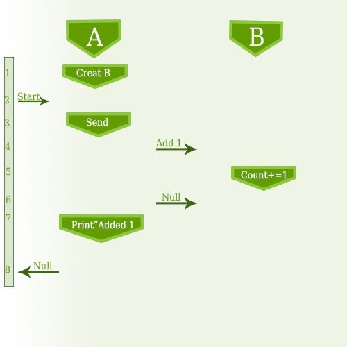

JActor2 is a multi-threaded OO programming model,
inspired by Alan Kay's early thoughts on [Objects](http://c2.com/cgi/wiki?AlanKaysDefinitionOfObjectOriented).
JActor2 is based on asynchronous 2-way messaging with assured responses, which lends itself to the development
of robust applications.

- [Background](#background)
    - [Multi-threading with Locks](#multi-threading-with-locks)
    - [Multi-threading with Actors](#multi-threading-with-actors)
- [Introducing JActor2](#introducing-jactor2)
    - [Synchronous Call](#synchronous-call)
    - [Asynchronous Send](#asynchronous-send)
    - [Exceptions](#exceptions)
    - [Partial Failure](#partial-failure)
- [Summary](#summary)
- [Upcoming Projects](#upcoming-projects)
- [Links](#links)

Background
=====

Multi-threading with Locks
-----

Computers continue to increase in power, but they do so by adding more processing cores.
Over time then, applications which are not able to make use of all the threads supported by the newer
computers will end up using a smaller and smaller proportion of the available resources.

Problems often arise when more than one thread is executing the same code. Some code is thread-safe, meaning that
more than one thread can execute it at the some time. But when code is not thread-safe, there can be non-deterministic
behavior, called race conditions, which vary depending on the exact order of execution and on if both threads share the
same memory cache.

Race conditions need to be identified and the unsafe code is typically surrounded by a lock which prevents more than
one code from executing the same code at the same time. But the identification of race conditions is often difficult,
and the use of locks can slow execution considerably.
When more than one lock is used, a deadlock can result if the locks are not always used by all thread in the same
order. The requirement of maintaining a consistent locking order sometimes becomes difficult as well, as the order must
be global in scope.

Multi-threading with Actors
-----

[Actors](http://en.wikipedia.org/wiki/Actor_model) are an alternative strategy to multi-threading with locks.
Actors are light-weight threads which interact via messages passed between them. Each actor has a queue of
pending messages (an inbox). And there is typically a thread pool used to process a queue of inactive actors
which have messages pending. Once an actor receives control, i.e. is assigned a thread, it process its pending
messages until there are none remaining and then releases the thread.

An actor never receives control from more than one thread at a time.
So the messages sent to an actor are processed one at a time.
This is how race conditions are prevented.
But there are several problems with actors:

- Actors provide 1-way messaging with problematic support for request/response.
And there is no assurance that a response will be received.
- Excessive dependency on 1-way messaging sometimes leads to message flooding, which slows
garbage collection and gives rise to the occasional out-of-memory error.
- Actors tend to be fragile, with restarts by supervisors and consequently the potential for lost messages.

Actors generally implement request/response (2-way messaging) in one of two ways,
either by blocking the thread until a response is
received, or by selecting only the expected response message for processing and processing other messages
only after the response has been processed. Either way, there is the
possibility of a deadlock occurring, depending on the design of the actor to which the request is sent.

The simplest case of deadlock is when two actors each send a request to the other. At this point, neither
actor will process any further messages. A review of each actor in isolation will not reveal any problems,
as this is a case of actor coupling.

Unfortunately, this problem rarely comes up in simple designs or initial implementations. It is only as
the code matures and the complexity increases that deadlocks begin to occur. Supervisors detect such failed
actors and restart them, which in turn gives rise to the increased chance that messages will be lost. So
timeouts are often added, further increasing the complexity of the code and potentially giving rise to an
increasing frequency of deadlocks.

Coupling, as we all know, is a bad thing.

Introducing JActor2
=====

JActor2 differs from other actor frameworks in several ways:

1. Request messages are single-use objects and are bound to the actors they operate on,
providing a context for subsequent interaction with other actors.
2. Uncaught exceptions and responses are passed back to the context from which a request originated,
modeling the way exceptions and return values are handled with Java method calls.
3. For every request that is sent to another actor, there is every assurance that a response or exception
will be passed back.
5. Messages (requests/responses) are processed in the order they are received by an actor.

There are three things of particular note here:

1. Uncaught exceptions are passed back to the context which originated a request, i.e. to the context most likely able
to handle those exceptions. This differs from more traditional actor frameworks where the supervisor of an actor
must handle the exceptions without knowledge of the context from which they arose.
2. A response or exception is passed back for every request that is sent, though processing is entirely asynchronous.
This is largely the result of modeling requests after Java method calls, but with additional support for detecting
infinite loops and erroneous request processing.
3. Messages are not selected for processing based on the state of the actor, but are processed in the order received.
Actors then are not coupled, so
deadlocks are less likely and maintenance is much easier over the life of a project.

Before going any further, we need to define a few terms:

- Actors in JActor2 are called
[reactors](http://www.agilewiki.org/docs/api/org/agilewiki/jactor2/core/reactors/package-summary.html).
Reactors are composable.
- The components of a reactor are called
[blades](http://www.agilewiki.org/docs/api/org/agilewiki/jactor2/core/blades/package-summary.html).
A blade has state and a reference to the reactor it is a part of,
though the default constructor of a blade will often create its own reactor.
Blades define the requests which operate on their state.
- Messages are called
[requests](http://www.agilewiki.org/docs/api/org/agilewiki/jactor2/core/requests/package-summary.html)
and are first class single-use objects.
Requests are bound to a blade or reactor and are evaluated (executed)
only on the reactor's thread.
After a request has been evaluated and has a result, it becomes a response
and is passed back to the reactor which originated the request.
- When a request is sent by one actor to another actor, a callback is assigned to the request.
The callback is a subclass of
[AsyncResponseProcessor](http://www.agilewiki.org/docs/api/org/agilewiki/jactor2/core/requests/AsyncResponseProcessor.html)
and has a single method, processAsyncResponse.
When a response is passed back to the originating reactor, the processAsyncResponse method is called on the thread of
the originating actor.

Synchronous Call
-----

Reactors mostly interact with other reactors, but it is not turtles all the way down. Java programs begin of course
with a main method.

```java

    public class M {
        public static void main(final String[] _args) throws Exception {
            new Plant();
            try {
                A a = new A();
                a.new Start().call();
            } finally {
                Plant.close();
            }
        }
    }
```

1. A Plant is created. Plant in turn creates a thread pool.
(Plant is a singleton and its methods are all static.)
2. A blade, A, is created, which in turn creates its own reactor.
3. A request bound to blade A, Start, is created.
4. The Start request is passed to A's reactor.
5. The main thread waits for an assured response or an exception. (A
[ReactorClosedException](http://www.agilewiki.org/docs/api/org/agilewiki/jactor2/core/reactors/ReactorClosedException.html)
is thrown if the Start request hangs.)
6. The plant is closed, which in turn closes blade A's reactor and the thread pool.

Asynchronous Send
-----

Sending a request from one blade to another is fairly simple.
Let use say that a Start request in blade A wants to send an Add1 request to blade B.

```java

    class A extends NonBlockingBladeBase {
        class Start extends AsyncBladeRequest<Void> {
            B b = new B();

            AsyncResponseProcessor<Void> startResponse = new AsyncResponseProcessor<Void>() {
                @Override
                public void processAsyncResponse(Void _response) throws Exception {
                    System.out.println("added 1");
                    Start.this.processAsyncResponse(null);
                }
            };

            @Override
            public void processAsyncRequest() {
                send(b.new Add1(), startResponse);
            }
        }
    }

    class B extends NonBlockingBladeBase {
        private int count;

        class Add1 extends AsyncBladeRequest<Void> {

            @Override
            public void processAsyncRequest() {
                count += 1;
                processAsyncResponse(null);
            }
        }
    }
```

1. Blade B is created in the constructor of the Start request, along with startResponse.
2. The Start request is added to the inbox of blade A's reactor.
3. Blade A's reactor evaluates the Start request. The Start request creates the Add1 request and adds it
to the inbox of Blade B's reactor.
4. Blade B's reactor evaluates the Add1 request. The Add1 request adds 1 to blade B's count.
5. The Add1 request is assigned a result value of null and is passed back to blade A's reactor.
6. The startResponse callback is evaluated by blade A's reactor. The callback prints "added 1".
7. The Start request is assigned a result value of null and is passed back to the reactor which originated the
Start request.



Exceptions
-----

When an exception is raised and uncaught while processing a request, the natural thing to do is to pass that exception
back to the originating request. It would be nice to use try/catch to intercept that exception in the originating
request, but that is simply not possible. So we use an
[ExceptionHandler](http://www.agilewiki.org/docs/api/org/agilewiki/jactor2/core/requests/ExceptionHandler.html)
instead.

```java

    class A extends NonBlockingBladeBase {
        class Start extends AsyncBladeRequest<Void> {
            B b = new B();

            AsyncResponseProcessor<Void> woopsResponse = new AsyncResponseProcessor<Void>() {
                @Override
                public void processAsyncResponse(Void _response) {
                    System.out.println("can not get here!");
                    Start.this.processAsyncResponse(null);
                }
            };

            ExceptionHandler<Void> exceptionHandler = new ExceptionHandler<Void>() {
                @Override
                public void processException(final Exception _e,
                                             final AsyncResponseProcessor<Void> _arp)
                        throws Exception {
                    if (_e instanceof IOException) {
                        System.out.println("got IOException");
                        _arp.processAsyncResponse(null);
                    } else
                        throw _e;
                }
            };

            @Override
            public void processAsyncRequest() {
                setExceptionHandler(exceptionHandler);
                send(b.new Woops(), woopsResponse);
            }
        }
    }

    class B extends NonBlockingBladeBase {
        class Woops extends AsyncBladeRequest<Void> {

            @Override
            public void processAsyncRequest() throws IOException {
                throw new IOException();
            }
        }
    }
```

1. Blade B is created in the constructor of the Start request, along with the woopsResponse and the exceptionHandler.
2. The Start request is added to the inbox of blade A's reactor.
3. Blade A's reactor evaluates the Start request.
The start request is assigned the exceptionHandler.
A Woops request is created and added to the inbox of blade B's reactor.
4. Blade B's reactor evaluates the Woops request,
which throws an IOException.
5. The Woops request is assigned a result value of IOException and is passed back to to blade A's reactor.
6. The exceptionHandler is evaluated by blade A's reactor with a value of IOException, which.
prints "got IOException"
7. The Start request is assigned a result value of null and is passed back to the reactor which originated the Start request.

When a request does not have an exception handler, any uncaught or unhandled exceptions are simply passed up
to the originating request. Exceptions then are handled very much as they are when doing a method call.

There is a huge advantage to this approach. When a request is sent, the originating request will **always** get
back either a result or an exception. So you do not need to write a lot of defensive code, making your applications
easier to write and naturally more robust.

Partial Failure
-----

Reactors can be closed and when they are,
all pending requests sent to them are passed back a
[ReactorClosedException](http://www.agilewiki.org/docs/api/org/agilewiki/jactor2/core/reactors/ReactorClosedException.html).
And once closed, all subsequent requests immediately receive a ReactorClosedException.

When JActor detects a problem that can result in corrupted state while a request is being processed,
the default reaction is to log the problem and close the reactor. Some examples:

- An uncaught RuntimeException is thrown.
- A StackOverflowError is thrown.
- A message takes too long to process.
- A message is processed, no response has been passed back, and there are no pending requests. (Hung request.)

The ReactorClosedException itself is a RuntimeException, and if a request's ExceptionHandler rethrows
ReactorClosedException, then the request's reactor is also closed.
So it is important to catch this exception at the points where a partial failure can be handled.

The key here is that any sufficiently large program will have bugs, and isolating a failure to a few reactors
can be very important. The failed reactors can then be optionally restarted.

Summary
=====

We have looked at some of the key aspects of JActor2, but much remains. The API is extensive and supports a wide
range of multi-threading requirements. A good next step would be to look at the
[core tutorial](http://www.agilewiki.org/docs/tutorials/core/index.html).

Upcoming Projects
=====

- JActor2 [modules](https://github.com/laforge49/JActor2/issues?milestone=10) (alpha)
    - A  classpath loader is needed so different modules can access different jar files.
    - The API needs cleaning up and the javadocs updated.
    - Integration of facilities with ZooKeeper would move JActor nicely towards cluster support.
    - The tutorial needs a lot of work.
- JActor2 [logback](https://github.com/laforge49/JActor2/issues?milestone=13) (new)
    - Integration with [logback](http://logback.qos.ch/) would provide added support for clusters.
    - [Groovy](http://logback.qos.ch/manual/groovy.html) can be used for logback configuration.
    [ServerSocketAppender](http://logback.qos.ch/manual/appenders.html) and
    [SocketReceiver](http://logback.qos.ch/manual/receivers.html) can used to pass the logs.
    This would allow us to have multiple nodes that do the file logging. These nodes then would need
    to be configured with one SocketReceiver per ZooKeeper node of interest.
- JActor2 [web](https://github.com/laforge49/JActor2/issues?milestone=14) (new)
    - Integration of JActor2 with something like netty's web server would make it easier to use JActor2 based servlets.
- JActor2 [util](https://github.com/laforge49/JActor2/issues?milestone=15) (alpha)
    - The code needs a good rework, using composition to simplify the API much the same way it was done in core.
    A super high-speed serialization library is important, but no if no one understands how to use it.
    - A tutorial is needed.
- JActor2 [db](https://github.com/laforge49/JActor2/issues?milestone=16) (new)
    - A high-performance database with live backups that builds on JActor2 serialization and distributed logging
    could be very useful in building scalable applications.

Links
-----

- [Core Tutorial](http://www.agilewiki.org/docs/tutorials/core/index.html) beta
- [API](http://www.agilewiki.org/docs/api/index.html)
- [Downloads](http://www.agilewiki.org/downloads)
- Dependencies: [slf4j](http://www.slf4j.org/), [guava](https://code.google.com/p/guava-libraries/)
- [Google Group](https://groups.google.com/forum/?hl=en&fromgroups#!forum/agilewikidevelopers)
- License: [The Apache Software License, Version 2.0](http://www.apache.org/licenses/LICENSE-2.0.txt)
- [JActor](https://github.com/laforge49/JActor) - the predecessor to JActor2
- benchmark: [repository](https://github.com/skunkiferous/PingPong), [results](http://skunkiferous.github.io/PingPong/)
